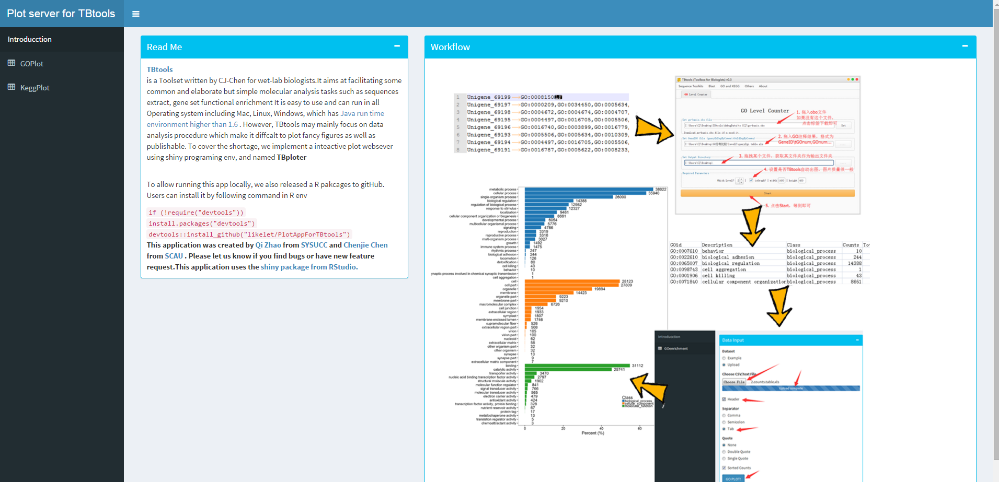
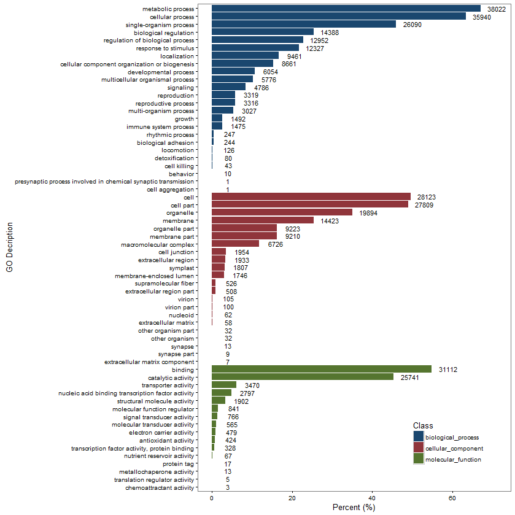

# PlotAppForTBtools
TBtools is a Toolset written by CJ-Chen for wet-lab biologists.It aims at facilitating some common and elaborate but simple molecular analysis tasks such as sequences extract, gene set functional enrichment It is easy to use and can run in all Operating system including Mac, Linux, Windows, which has Java run time environment higher than 1.6 . However, TBtools may mainly focus on data analysis procedure which make it diffcalt to plot fancy figures as well as publishable. To cover the shortage, we implement a inteactive plot websever using shiny programing env, and named TBploter

**Screen shoot of TBploter**


### Function gallary
**GOenriment ploter**

**KEGGenrichment ploter**


### Install dependencies
To check the dependencies installed correctly, this command can help users to check the status of each installation<br/>
```R
library("Packages for check")
```
Code for install dependencies R packages 
```R
cDep <- c("ggplot2","shiny","shinyBS","shinydashboard","ggthemes","DT")

###INSTALLED PACKAGES
#get installed list
inst <- packageStatus()$inst

#check and install DEPENDENCIES from CRAN
for(i in 1:length(cDep)){
  tag = which(inst$Package == cDep[i])
  if(length(tag)){
    remove.packages(cDep[i])
  }
  install.packages(cDep[i])
}

```
### Install TBploter
To install the latest development build directly from GitHub, run this:

```R
if (!require("devtools"))
  install.packages("devtools")
devtools::install_github("likelet/PlotAppForTBtools")
```
### Designers:
Qi Zhao, zhaoqi3@mail2.sysu.edu.cn<br/>

### Developers:
Qi Zhao, zhaoqi3@mail2.sysu.edu.cn <br/>
Chenjie Chen,120509419@qq.com

### Maintainer:
Qi Zhao
Please feel free contact us. <br/>

### Copyright
MIT license

### Citation 
During developing